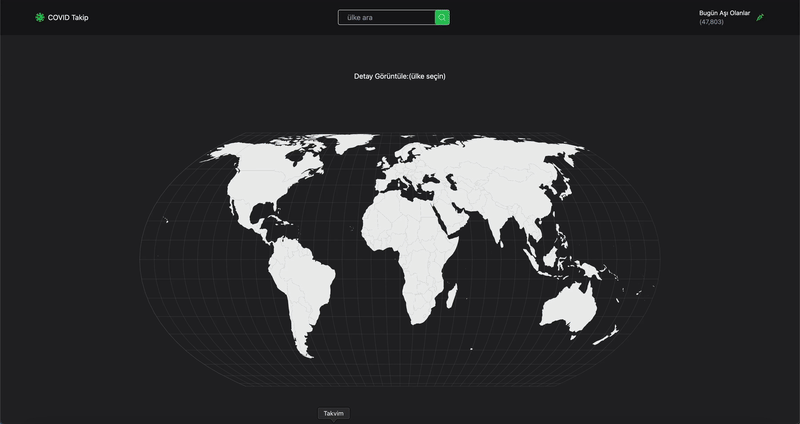

# Covid-Map

## Libraries

- React
- react-router-dom
- react-icons
- tailwind
- react-simple-maps
- @reduxjs/toolkit
- react-redux
- @testing-library/user-event@14.0
- axios@^0.27.2
- react-testing-library
- jest

## API

1.API (Covid Verisi): https://rapidapi.com/axisbits-axisbits-default/api/covid-19-statistics/playground/apiendpoint_191c58c7-a995-4024-a5ee-41043d79e542

2.API: (ülke Bilgileri): https://restcountries.com/

## Screen Gif

